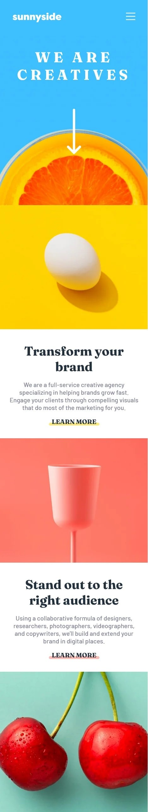
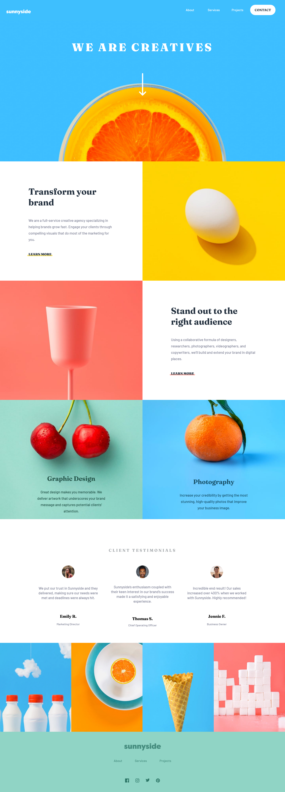
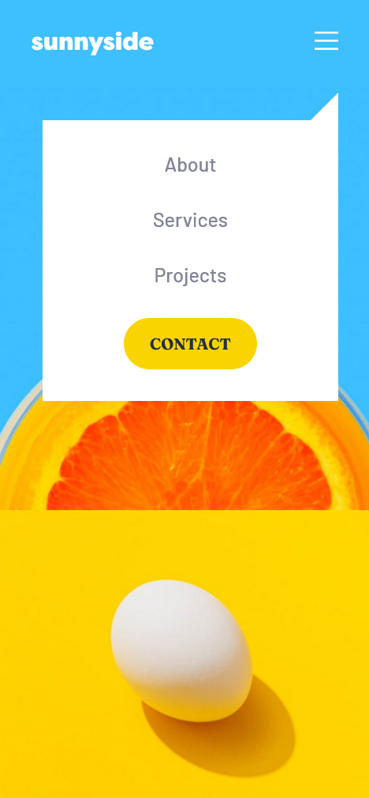

# Frontend Mentor - Sunnyside Agency Landing Page


## Welcome! 👋

# Frontend Mentor - Sunnyside Agency Landing Page Solution

This is a solution to the [Sunnyside Agency Landing Page challenge on Frontend Mentor](https://www.frontendmentor.io/challenges/sunnyside-agency-landing-page-7yVs3B6ef). Frontend Mentor challenges help you improve your coding skills by building realistic projects.

## Table of contents

- [Overview](#overview)
  - [The challenge](#the-challenge)
  - [Screenshot](#screenshot)
  - [Links](#links)
- [My process](#my-process)
  - [Built with](#built-with)
  - [What I learned](#what-i-learned)
  - [Useful resources](#useful-resources)
- [Author](#author)

## Overview

### The challenge

Users should be able to:

- View the optimal layout for the site depending on their device's screen size
- See hover states for all interactive elements on the page

### Screenshot

## Mobile Preview



## Desktop Preview



## Mobile Menu Preview



## Active States Preview


### Links

- Solution URL: https://github.com/DwarakanathAkkala/sunnyside-agency-landing-page
- Live Site URL: https://sunnyside-agency-dwaraka.netlify.app/

## My process

### Built with

- Semantic HTML5 markup
- CSS custom properties
- Flexbox
- CSS Grid
- Mobile-first workflow

### What I learned

```html
<!-- Do not autofill the number input using "autocomplete" attribute -->

<!-- Using the fill attribute to change color of the SVG -->
<svg width="20" height="17" xmlns="http://www.w3.org/2000/svg">
  <path
    class="svg-path"
    d="M20 2.172a8.192 8.192 0 01-2.357.646 4.11 4.11 0 001.805-2.27 8.22 8.22 0 01-2.606.996A4.096 4.096 0 0013.847.248c-2.65 0-4.596 2.472-3.998 5.037A11.648 11.648 0 011.392 1a4.109 4.109 0 001.27 5.478 4.086 4.086 0 01-1.858-.513c-.045 1.9 1.318 3.679 3.291 4.075a4.113 4.113 0 01-1.853.07 4.106 4.106 0 003.833 2.849A8.25 8.25 0 010 14.658a11.616 11.616 0 006.29 1.843c7.618 0 11.923-6.434 11.663-12.205A8.354 8.354 0 0020 2.172z"
    fill="#2C7566"
    fill-rule="nonzero">
</svg>
```

```css
/* Using the Class selector with psuedo selectors "::before" and ":hover" at the same time */

.soft-red-bg::before {
  background: hsl(7 99% 70% / 0.5);
}

.article-content .soft-red-bg:hover::before {
  height: 8px;
  background: hsl(7 99% 70% / 1);
}
```

### Useful resources

- Marker Style Underline (https://sharkcoder.com/visual/underline#section4) - Colored Marker underline used in About Section of the Landing Page is developed using the mentioned article.

- Stack Overflow (https://stackoverflow.com/) - This helped me for manipulating DOM by targeting HTML elements using JS with optimised code.

## Author

- Website - [Dwarakanath](https://dwarakanath-akkala.netlify.app/)
- Frontend Mentor - [@DwarakanathAkkala](https://www.frontendmentor.io/profile/DwarakanathAkkala)
- Instagram - [@dwarakanath_akkala](https://www.instagram.com/dwarakanath_akkala/)
